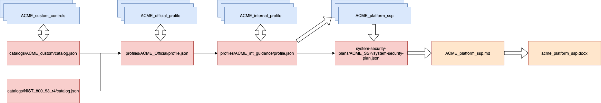

# compliance-trestle-ssp-demo

[Compliance-trestle](https://ibm.github.io/compliance-trestle) (trestle) is an assembly of functionality to facilitate compliance-as-code workflows, anchored in the [Open Security Controls Assessment Language](https://pages.nist.gov/OSCAL/) (OSCAL).

This repository illustrates how to use `trestle author` functionality to make OSCAL more approachable. 
Specifically it shows how some tasks, such as writing corporate guidance, SSP control implementation descriptions and setting of parameters can be simplified using a markdown workflow.

Markdown was specifically chosen as OSCAL leverages markdown as it's markup language in prose fields (for `json` and `yaml` formats only).

This repo is anchored around 'ACME Inc.' based on the description below. As additional capabilities are created in the core of trestle this repository will be expanded.

## ACME Inc requirements
ACME Inc have based their security controls on NIST 800-53 rev4. In addition to this ACME have created a number of supplementary controls based on various market based regulations they are exposed to. ACME needs to produce an SSP for their clients.

ACME have 'formal' guidance, including setting control parameters, which they release to their contractors, and separately additional guidance on 'best practices' within ACME to implement the controls.

ACME produce a word SSP which is used with clients for the services ACME provide, until such a time at which their clients can directly consume OSCAL.

### Currently out of scope
ACME is planning on FedRAMP, however, this is not part of the current scope.

## Using the demo
The demo has been pre-configured with an set of interlocking catalogs, profiles, and SSPs.

The diagram above shows how the repository operates. Red boxes are OSCAL json objects, blue are editable markdown equivalents, and orange boxes are target output documents. The narrow black lines represent information flow, during profile resolution processes, care of OSCAL hrefs. The thick white arrows represent information flow due to the execution of trestle commands.

In this demo there are four OSCAL objects that can be updated by editing markdown equivalent documents, per control.
1. The custom control catalog. The prose for the control statements can be added and removed through the `ACME_custom_controls` directory
2. The ACME official profile. Parameters can be set and additional guidance can be provided in `ACME_official_profile`.
3. The ACME internal profile, that incorporates the official profile, where additional internal guidance can be added. 
4. The system security plan, where responsible roles, control implementation status, and the control responses can be set in `ACME_platform_ssp`.

A sync between the OSCAL and markdown equaivalents can be triggered by running `make update-markdown`. Note that if you were adding another OSCAL object you would need to run an equivalent of `make bootstrap-markdown`.

### Output documents.
1. Running `make ssp-word` will execute the full pipline.
   1. Steps below provide individual details.
2. `trestle author jinja` is used to convert from the OSCAL ssp to a single markdown document.
   1. This can be executed by running `make ssp-markdown` to update `acme_platform_ssp.md`
   2. This uses the jinja template `acme_platform_ssp.md.jinja`
      1. Note that the template currently includes the `ssp_frontmatter.md` document. 
         1. Arbitrary other documents can be included using `md_clean_include` `md_section_include`, provided by trestle, or `include` part of the core jinja templating engine.
      2. The template can be edited as desired.
3. Based on `acme_platform_ssp.md` `make ssp-word` will generate a readable word document, including images.

### What requires editing the OSCAL json?
- Adding groups / controls to the catalog
- Editing the controls within a profile
- Editing additional metadata.

## Running this demo locally:
- Trestle version 0.33.1 and above is required.
- Users will need to [install pandoc](https://pandoc.org/installing.html). Known to work above version `2.16.2`

## Current caveats:
- Link resolution
  - In order for pandoc to operate correctly on links (such as images) they must be correct in the final output. This implies that all links should relative too the location of the output of `trestle author jinja`
  - The net result: keep any markdown includes in the same folder as the output of `trestle author jinja`
- Magic data:
  - `x-trestle-fedramp` props are magic data at the moment with trestle, and must come from the `-y` argument.
- Bugs:
  - https://github.com/IBM/compliance-trestle/issues/966
  - https://github.com/IBM/compliance-trestle/issues/967
  - https://github.com/IBM/compliance-trestle/issues/968